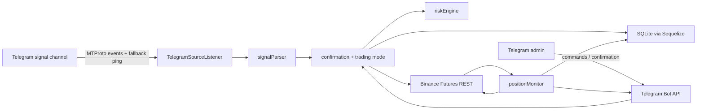

# Архітектура EADrift

## Призначення

EADrift автоматизує виконання Telegram-сигналів на Binance USD-M Futures. Система має одну точку запуску, працює в одному Node.js процесі та поєднує інтеграційний, торговий і persistence-шари.

## Контекст системи



## Шари та відповідальність

| Шар | Модулі | Відповідальність |
|---|---|---|
| Bootstrap | `src/index.js` | Порядок запуску, зв'язування модулів, graceful shutdown listener-а |
| Config | `src/config/app.config.js` | Читання `.env`, перевірка обов'язкових змінних |
| Signal source | `src/sources/telegram/TelegramSourceListener.js`, `src/module/telegram/TelegramClient.js` | MTProto-підключення, NewMessage events, fallback ping, дедуплікація |
| Parsing | `src/parser/signalParser.js` | Перетворення тексту каналу на `SIGNAL`, `REPORT` або `null` |
| Decision layer | `src/bot/confirmation.js`, `src/core/tradingMode.js` | Market validation, risk calculation, auto/confirm/reject рішення |
| Operator interface | `src/bot/telegram.js`, `src/bot/commands.js` | Telegram Bot API, admin guard, команди й повідомлення |
| Trading core | `src/core/riskEngine.js`, `src/core/positionMonitor.js` | Розмір позиції, leverage, TP/SL стратегія, polling |
| Exchange adapter | `src/exchanges/binance.js` | HMAC REST-запити, market data, positions, orders, SL/TP |
| Persistence | `src/module/db/*` | SQLite, Sequelize-моделі, repository та аналітичні запити |
| Shared | `src/shared/*` | Winston logger, консольні утиліти, banner |

## Залежності між модулями

Основний напрям залежностей:

```text
index
├── bot / source listener
├── positionMonitor
└── database

source listener -> signalParser -> confirmation
confirmation -> riskEngine -> binance
confirmation -> tradeRepository
confirmation -> positionMonitor
positionMonitor -> binance
positionMonitor -> tradeRepository
commands -> binance / positionMonitor / tradingMode
tradeRepository -> database models
analytics -> database models / raw SQL
```

`tradeRepository.js` є основним API для доступу бізнес-логіки до БД. `analytics.js` читає дані окремо для звітів.

## Структура репозиторію

```text
EADrift/
├── docs/
│   ├── README.md
│   ├── ARCHITECTURE.md
│   ├── FLOWS.md
│   ├── TRADING_STRATEGY.md
│   ├── DATA_MODEL.md
│   ├── OPERATIONS.md
│   └── KNOWN_LIMITATIONS.md
├── logs/                         # runtime-логи, створюються Winston
├── src/
│   ├── bot/
│   │   ├── commands.js           # admin slash-команди
│   │   ├── confirmation.js       # рішення та виконання сигналу
│   │   └── telegram.js           # Telegram Bot API singleton
│   ├── config/
│   │   └── app.config.js
│   ├── core/
│   │   ├── positionMonitor.js    # in-memory watchlist + polling
│   │   ├── riskEngine.js
│   │   └── tradingMode.js
│   ├── exchanges/
│   │   └── binance.js
│   ├── module/
│   │   ├── db/
│   │   │   ├── models/
│   │   │   │   ├── Signal.js
│   │   │   │   ├── Trade.js
│   │   │   │   ├── TradeEvent.js
│   │   │   │   └── SlHistory.js
│   │   │   ├── analytics.js
│   │   │   ├── database.js
│   │   │   └── tradeRepository.js
│   │   └── telegram/
│   │       └── TelegramClient.js
│   ├── parser/
│   │   └── signalParser.js
│   ├── shared/
│   │   ├── logger.js
│   │   ├── message.js
│   │   └── utils.js
│   ├── sources/
│   │   └── telegram/
│   │       └── TelegramSourceListener.js
│   └── index.js
├── .env
├── .env.example                  # зараз порожній
├── package.json
└── README.md
```

`src/data/trading.db` не існує до першої успішної ініціалізації БД і створюється автоматично.

## Runtime state

У пам'яті процесу зберігаються:

- поточний торговий режим;
- pending-картки підтвердження з TTL;
- `watchlist: Map<symbol, meta>`;
- кеш Binance `exchangeInfo` на 5 хвилин;
- набір ID уже оброблених Telegram-повідомлень.

У SQLite зберігаються сигнали, угоди, події та історія SL. Після рестарту відновлюється лише watchlist для угод, які одночасно відкриті в БД і на Binance. Pending-підтвердження та торговий режим не відновлюються.

## Інтеграційні межі

### Telegram

- Bot API (`node-telegram-bot-api`) використовується для команд, підтверджень і сповіщень.
- MTProto (`telegram`/gramjs) використовується для читання каналу.
- Усі bot-команди захищені перевіркою `TELEGRAM_ADMIN_CHAT_ID`.

### Binance

- REST-виклики реалізовані вручну через `axios`.
- Приватні запити підписуються HMAC SHA-256.
- Використовуються USD-M Futures endpoints `/fapi/*`.
- SL і TP завжди мають явний `quantity` та `reduceOnly=true`.

### SQLite

- Sequelize з dialect `sqlite` і пакетом `sqlite3`.
- Таблиці синхронізуються через `db.sync({ alter: false })`.
- Автоматичних міграцій немає.

