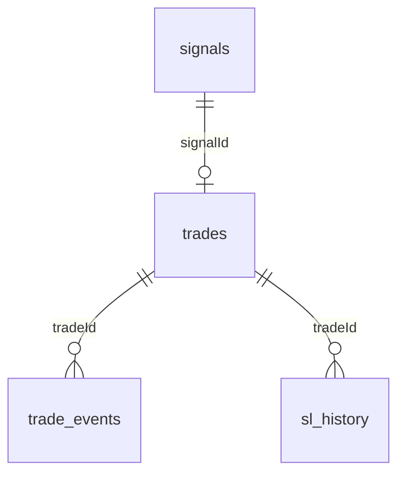

# Модель Даних

## Загальна схема

База даних — SQLite-файл `src/data/trading.db`, доступ через Sequelize.



`db.sync({ alter: false })` створює відсутні таблиці, але не виконує керовані schema migrations.

## `signals`

Один запис на розпарсений торговий сигнал незалежно від результату.

Ключові поля:

- ідентифікація: `id`, `signalId`, `symbol`, `side`;
- план: `entryLow`, `entryHigh`, `entryMid`, `slPrice`, `tpPrices`, `timeframe`;
- джерело: `accuracy`, `rawText`, `priceAtSignal`, `receivedAt`;
- рішення: `status`, `rejectReason`.

Життєвий цикл:

```text
PENDING -> TRADED | REJECTED | FAILED | EXPIRED | CANCELLED
PAUSED  створюється як PENDING і одразу оновлюється до PAUSED
```

`FAILED` означає, що сигнал був підтверджений або обраний для автовиконання,
але створення позиції завершилося помилкою.

## `trades`

Один запис описує позицію від відкриття до закриття.

Групи полів:

| Група | Поля |
|---|---|
| Зв'язок | `id`, nullable `signalId` |
| Позиція | `symbol`, `side`, `entryType`, `entryPrice`, `entryPricePlanned` |
| Ордери | `entryOrderId`, `slOrderId` |
| План | `slPriceInitial`, `slPriceFinal`, `tpPrices`, `tp1Hit..tp4Hit` |
| Розмір і ризик | `quantity`, `positionUsdt`, `leverage`, `riskPerTradeUsdt`, `riskPerTradePct`, `balanceAtEntry` |
| Результат | `exitPrice`, `profitUsdt`, `profitR`, `profitPct`, `closeReason` |
| Поведінка | `maxDrawdownPct`, `maxProfitPct`, `interval`, `tradingMode`, `notes` |
| Час і стан | `openedAt`, `closedAt`, `timeInTradeMs`, `status` |

Статуси:

```text
OPEN -> PARTIALLY_CLOSED -> CLOSED
OPEN --------------------> CLOSED
```

`recordPartialClose()` змінює статус на `PARTIALLY_CLOSED`, але не зменшує `trades.quantity`.

## `trade_events`

Append-only хронологія значущих подій trade.

Поля: `tradeId`, `eventType`, `price`, `closedFraction`, `closedQuantity`, `slFrom`, `slTo`, `unrealisedPnlUsdt`, `meta`, `occurredAt`.

Типи подій:

```text
TRADE_OPENED, TRADE_CLOSED, PARTIAL_CLOSE
TP1_HIT, TP2_HIT, TP3_HIT, TP4_HIT
SL_MOVED_BE, SL_MOVED_TP1, SL_MOVED_TP2, SL_MOVED_TRAILING, SL_MOVED_MANUAL
MOMENTUM_WEAK, MOMENTUM_STRONG
FAKE_BREAKOUT_DETECTED, EARLY_EXIT_TIMEOUT, TRAILING_ACTIVATED
POSITION_DISAPPEARED
```

Не кожен оголошений event type зараз записується всіма відповідними flow. Наприклад, timeout закриває trade, але окремий `EARLY_EXIT_TIMEOUT` event напряму не додається.

## `sl_history`

Окрема історія переміщень stop-loss для аналізу BE+ і trailing.

Поля: `tradeId`, `reason`, `slPricePrev`, `slPriceNew`, `markPrice`, `distanceFromPricePct`, `orderId`, `movedAt`.

Причини:

```text
INITIAL, BE_PLUS, TP1, TP2, TRAILING, MANUAL
```

Під час `addSlMove()`:

```text
distanceFromPricePct =
  |markPrice - slPriceNew| / markPrice × 100
```

`addSlMove()` також оновлює rolling-поле `trades.slPriceFinal`. Окремі `SL_MOVED_*` типи оголошені в `EVENT_TYPES`, але поточний repository не створює їх автоматично.

## Repository API

`src/module/db/tradeRepository.js` надає:

- signals: `saveSignal`, `updateSignalStatus`;
- trade lifecycle: `openTrade`, `recordPartialClose`, `closeTrade`;
- tracking: `markTPHit`, `updatePeakDrawdown`, `addEvent`, `addSlMove`;
- queries: `findOpenTrade`, `getOpenTrades`, `getTradeWithHistory`, `getTradeSummary`.

DB-помилки в більшості update-функцій логуються і не кидаються далі. `saveSignal()` та `openTrade()` кидають помилку, але caller може її перехопити.

## Аналітика

`src/module/db/analytics.js` містить запити:

- `slOptimizationReport`;
- `maeReport`;
- `tpHitRate`;
- `closeReasonBreakdown`;
- `trailingEfficiency`;
- `beEffectiveness`;
- `symbolStats`;
- `modeStats`;
- `signalRejectionStats`;
- `equityCurve`.

Вони не підключені до Telegram-команд або окремого CLI/API. Частина звітів використовує raw SQL; див. обмеження щодо назв колонок у [KNOWN_LIMITATIONS.md](./KNOWN_LIMITATIONS.md).

## Відновлення та узгодженість

БД не є єдиним джерелом істини для відкритої позиції: під час старту її стан звіряється з Binance.

- Trade є в БД і на Binance: відновити watchlist.
- Trade є в БД, але відсутній на Binance: закрити trade як `manual`, без відомого PnL/exit price.
- Position є на Binance, але trade відсутній у БД: автоматично до watchlist не додається.
