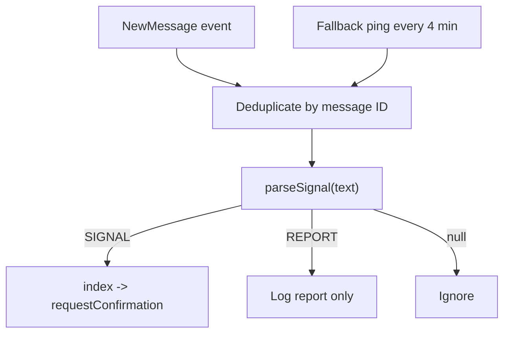
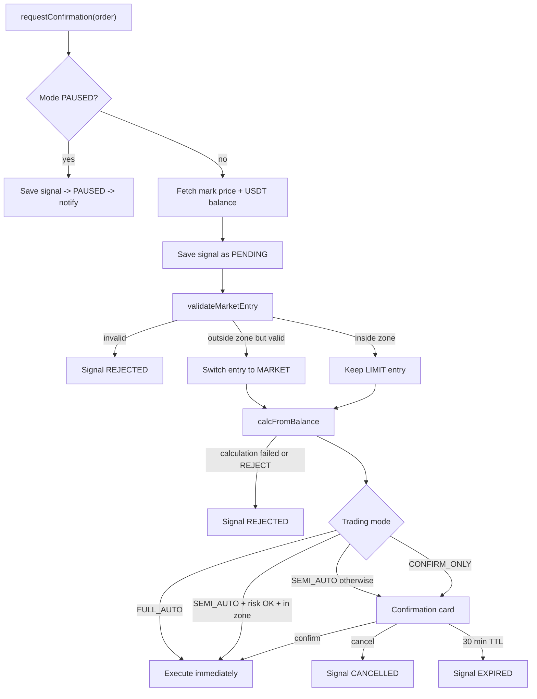
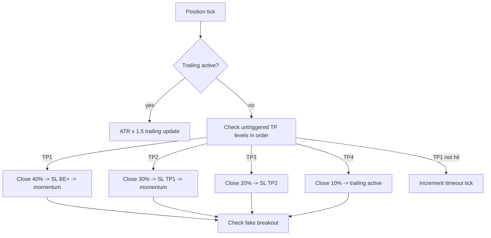

# Поточні Flow

## 1. Запуск системи

`src/index.js` виконує кроки послідовно:

1. Показує banner і лог старту.
2. Ініціалізує SQLite та синхронізує таблиці.
3. Запускає Telegram Bot API polling.
4. Реєструє slash-команди й callback handler підтверджень.
5. Підключає Telegram notifier до position monitor.
6. Запускає monitor з інтервалом `MONITOR_INTERVAL_MS`.
7. Звіряє відкриті угоди в БД з позиціями Binance та відновлює watchlist.
8. Якщо задані MTProto session і channel ID, підключається до каналу.
9. Надсилає адміністратору повідомлення про готовність.

Якщо відсутня будь-яка обов'язкова змінна Binance/Bot API, `app.config.js` завершує процес. Відсутні MTProto-змінні лише вимикають channel listener.

## 2. Отримання та парсинг сигналу

Parser розпізнає:

- `SIGNAL`: symbol, LONG/SHORT, timeframe, entry zone, TP-масив, SL, trend line, accuracy, signal ID;
- `REPORT`: symbol, optional side, signal ID і raw text;
- інший текст повертає `null`.

Для entry zone parser очікує формат `Entry Zone: HIGH - LOW`: перше число записується як `entryHigh`, друге як `entryLow`.

## 3. Рішення щодо нового сигналу

Порядок market validation:

1. SL ще не порушений.
2. TP1 ще не досягнутий.
3. Вихід із entry zone не перевищує 2%.
4. R:R від поточної ціни до TP1 не нижчий за 1.5.

Картка підтвердження живе 30 хвилин; за 5 хвилин до завершення надсилається нагадування.

## 4. Виконання угоди

`executeOrder()`:

1. Встановлює `ISOLATED` margin і розраховане leverage.
2. Викликає `openFullPosition()`.
3. Для MARKET використовує реальну `avgPrice` як entry price.
4. Створює `trades`, початковий запис `sl_history` і `TRADE_OPENED`.
5. Позначає signal як `TRADED`, лише якщо trade успішно записаний у БД.
6. Додає позицію до in-memory watchlist.

`openFullPosition()`:

1. Виставляє MARKET або LIMIT entry.
2. Для LIMIT чекає статус `FILLED`, polling кожні 1.5 секунди, максимум 120 секунд.
3. Виставляє STOP_MARKET на всю виконану кількість.
4. Виставляє TAKE_PROFIT_MARKET ордери за TP-розподілом.

Якщо TP-рівнів менше чотирьох, частки нормалізуються до 100% на наявні рівні.

## 5. Моніторинг позиції

Monitor запускає `tick()` через `setInterval`. Один tick:

1. Отримує всі відкриті позиції Binance.
2. Для позиції, що зникла з біржі:
   - додає `POSITION_DISAPPEARED`;
   - закриває відкритий запис trade з причиною `manual`, якщо він ще існує;
   - видаляє symbol із watchlist.
3. Для живої позиції отримує mark price.
4. Оновлює max drawdown/max profit у БД.
5. Виконує стратегію керування позицією.

TP-рівні перевіряються послідовно. Якщо нижчий ще не досягнутий, вищі в цьому tick не обробляються.

## 6. Відновлення після рестарту

`restoreWatchlistFromDB()` читає угоди зі статусом `OPEN` або `PARTIALLY_CLOSED` та звіряє їх із Binance:

- якщо позиція існує, watchlist відновлюється з TP flags і останнім SL;
- якщо позиції немає, trade закривається як `manual` з note `Closed while bot was offline`;
- `timeoutCandles` після рестарту встановлюється в `0`;
- `trailingActive` після рестарту встановлюється в `false`.

Відновлення не створює повторний `TRADE_OPENED`.

## 7. Ручне керування

- `/sl SYMBOL PRICE` переносить SL і синхронізує `watchlist.slPrice`.
- `/be SYMBOL` переносить SL у BE+, але зараз не синхронізує watchlist і не додає запис у `sl_history`.
- `/close SYMBOL FRACTION` виконує reduce-only MARKET close.
- `/cancel` і `/cancelall` скасовують ордери, але не змінюють watchlist або БД.
- `/mode` змінює режим лише до наступного рестарту.

